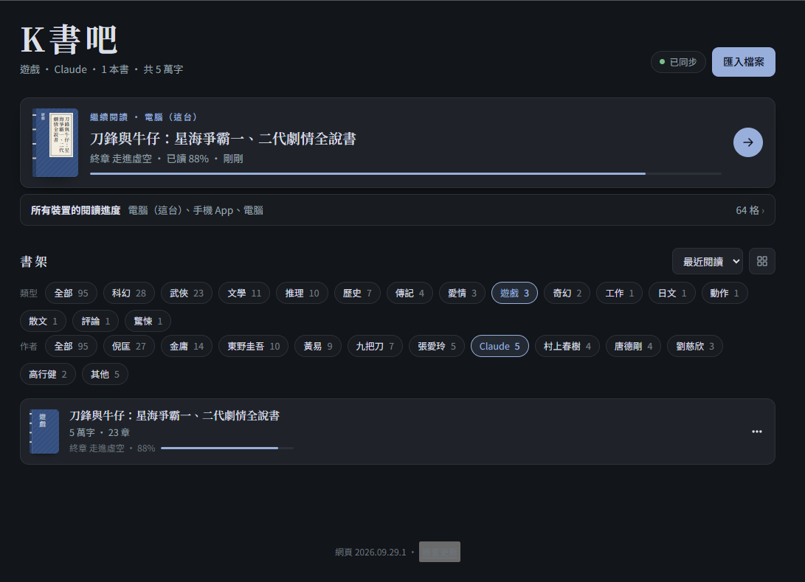

# K書吧 KBookBar

讀 AI 寫的書用的閱讀器，整個程式就是一個 `index.html`，用 GitHub Pages 發佈：

**https://agan0617.github.io/KBookBar/**

- 書架資料（書目、書檔、閱讀進度）**不在這個 repo**，而在使用者自己的**私有 repo**（作者的是 `agan0617/BookShelf`）
- 頁面用 GitHub REST API 讀寫那個 repo，需要的 token 由使用者在每台裝置貼一次，只存在那台裝置的 `localStorage`
- 這個 repo 是公開的（免費方案的 Pages 只能發佈公開 repo），但裡面只有程式、沒有書

## 用你自己的書架

任何人都可以用這個網頁讀**自己的**書：在你的 GitHub 帳號建一個私有 repo 當書架，貼上只授權那個 repo 的 token 就行。書和進度都存在你的 repo 裡，別人（包括這個頁面的作者）看不到。

### 1. 建書架 repo

1. GitHub 右上角「＋」→ **New repository**
2. Repository name 隨你取（例如 `BookShelf`），選 **Private**
3. 勾 **Add a README file**，讓 repo 一開始就有一個 commit（全空的 repo 沒有分支，寫不進去）
4. Create repository

裡面不用先放任何東西。`library.json`（書目）、`books/`（書檔）、`progress.json`（閱讀進度）會在你第一次匯入書、第一次存進度時自動建立。

### 2. 產生 token

1. GitHub → Settings → Developer settings → Personal access tokens → **Fine-grained tokens** → **Generate new token**（或直接開 https://github.com/settings/personal-access-tokens/new ）
2. **Repository access**：選 **Only select repositories**，只勾剛才建的書架 repo
3. **Permissions** → Repository permissions → **Contents** 設成 **Read and write**（Metadata 會自動變成唯讀，其他都不用開）
4. Expiration 自己決定；過期後照這幾步產生新的、重貼一次就好
5. 按 Generate token，**複製**產生的 `github_pat_…`（離開頁面後就看不到了）

### 3. 讓K書吧連上你的 repo

1. 打開 https://agan0617.github.io/KBookBar/
2. 按右上角的連線狀態（或書架上的「連上書架」）
3. 貼上 token
4. 展開「**換 repo（一般不用動）**」，把 `agan0617/BookShelf` 改成 **`你的帳號/你的 repo 名`**
5. 按「連線」，看到「已連上 你的帳號/你的 repo 名」就成功了

**每台裝置、每個瀏覽器都要各做一次**（手機瀏覽器、電腦瀏覽器、Android App 各算一台）——token 和 repo 設定只存在那台裝置裡，不會跟著帳號同步。書和進度則在 repo 裡，連上之後各台裝置看到的是同一個書架。

- 換手機或 token 過期：重貼 token，書會從 GitHub 再下載一次
- 手機弄丟：到 GitHub 的 Fine-grained tokens 頁面把那個 token 刪掉
- 「中斷連線」只會清掉這台裝置上的 token 和本機副本，repo 裡的書不受影響
- iPhone 建議用 Safari 把K書吧「加入主畫面」，從主畫面打開；不然太久沒開，Safari 可能會清掉網頁存的資料（包括 token）

### 4. 放書

按右上角「**匯入檔案**」選 `.md` 或 `.txt`（電腦也可以直接把檔案拖進視窗），一次選多個檔可以合併成一本。章節會自動切。

書架上有一本內建的「**K書吧使用說明**」，寫了章節怎麼切、怎麼朗讀，還有一段可以直接貼給 AI 的寫書格式要求——請 AI 寫書時把那段附上，匯入時章節就會切得剛好。

### 要不要自己架一份？

直接用上面的網址最省事，頁面改版你也會跟著拿到新功能。但這代表你的 token 是交給這個網址上的程式使用（程式只會把 token 送到 `api.github.com`，可以自己看 `index.html` 確認）。

不想跟著作者改版、或想自己改功能，就架一份自己的：

1. **Fork** 這個 repo
2. fork 的 Settings → **Pages** → Source 選 Deploy from a branch，Branch 選 `main`／`(root)` → Save
3. 把 `index.html` 裡的 `GH_DEFAULT` 改成你的書架 repo（`{ owner: '你的帳號', repo: '你的 repo 名', … }`），之後每台裝置就只要貼 token、不用再換 repo
4. 用 `https://你的帳號.github.io/KBookBar/` 打開

## 功能

- 匯入 .md／.txt（手機走檔案挑選器，電腦可以拖進視窗），多檔可以合併成一本
- 標籤：書檔 frontmatter 寫 `tags: 遊戲, 日本史`（或在編輯對話框填），書架上方會列出所有標籤，點一個只看那一類；沒書打標籤時不顯示
- 作者：標籤底下一排作者（讀書目的 `author`，不用另外打成標籤），兩本以上的作者各一格、其餘收在「其他」；可以跟標籤一起篩
- 自動切章節、目錄、字級／行高／字體／底色／版寬
- 朗讀（Web Speech API），可以定時停止；念的時候點段落就跳到那段接著念；不念程式碼區塊、「參考資料」這類整節、網址和 [4] 這種出處編號；標題前後停一下、念慢一點，換段、換章、對話前後也有停頓；破折號、倍數、羅馬數字這類符號整理成念得出來的說法；表格欄位之間、段落裡的換行處停一下，中文旁邊的半形標點當全形念
- 讀音字典：選取念錯的詞 →「修正讀音」（可試聽），分這本書／所有書，存在書架上；書檔 frontmatter 的 `pronounce:` 也算。畫面照樣是原文
- **本機副本**：每台裝置的瀏覽器用 IndexedDB 存一份完整書架（書目、書檔、進度）。打開時先顯示本機的，再跟書架 repo 比對：補下載新書與改版、清掉已下架的，沒網路也能讀
- **離線閱讀**：`sw.js`（Service Worker）把頁面本身、marked／DOMPurify、字型存在裝置上，沒網路也打得開（有網路時一律先抓最新頁面，8 秒內抓不到才用存的）。`manifest.webmanifest` 讓手機瀏覽器可以「加到主畫面」當 PWA 用；App 的 WebView 跑的是同一支 Service Worker，所以 App 離線也能開。網路回來時自動重新連上書架、補傳進度
- **版本**：書架最下面顯示網頁版本（`index.html` 開頭的 `WEB_VERSION`，格式「年.月.日」、同一天第二版起加 `.2`；**每次改 `index.html` 推上去都要改**），在 App 裡再加上 App 版本（`KBookNative.version()`）。「檢查更新」抓線上的 `index.html?ver=…`（`sw.js` 不經手，不會拿快取回答）比 `WEB_VERSION`；App 版本跟 [KBookBarApp 的 Releases](https://github.com/agan0617/KBookBarApp/releases) 最新 tag 比，App 裡每 12 小時自動查一次，有書架 token 就帶上避開未登入每小時 60 次的限制
- 閱讀進度同步：換章、回書架、離開頁面時各 commit 一次到 `progress.json`；同一章讀很久時最多每 3 分鐘補存一次；離線時讀的進度下次連上時補傳。進度記成 **slot**：每台裝置每本書每一章一格、全書架最多 99 格（同一章只更新位置，舊的自動掉出去），裝置之間不會互相蓋掉；「繼續閱讀」底下可以列出所有裝置的格子挑一格接著讀
- 朗讀設定（語音、速度、音量、定時停止）每台裝置各自記在 localStorage
- Android 上想在背景、關螢幕也繼續朗讀，用 [K書吧 Android App](https://github.com/agan0617/KBookBarApp)（同一個網頁包成 App，朗讀改用手機語音引擎）

## 書架 repo 的資料格式

一般用頁面匯入就好，不用手動改。要自己寫程式讀寫時參考：

| 檔案 | 內容 |
|---|---|
| `library.json` | `{"books":[…]}`，每本：`id`、`title`、`author`、`format`（`md`／`txt`）、`chars`、`chapters`、`file`、`addedAt`、`updatedAt`（毫秒時間戳）、`tags`（字串陣列，可省略；每本最多 8 個、每個最多 20 字） |
| `books/<作者>/<書名>.md`、`.txt` | 書檔原文（UTF-8）；按作者分子目錄（沒作者放 `未知作者`），檔名＝書名，撞名加 ` (2)`，實際路徑以書目的 `file` 為準 |
| `progress.json` | `{"_slots":[{"id","dev","name","ch","b","pct","t","at"},…],"<書 id>":{"ch","b","pct","t","at"}}`：`_slots` 是進度格清單（新的在前，最多 99 格；`id` 書 id、`dev` 裝置 id、`name` 裝置名），`ch` 章（從 0 起）、`b` 章內第幾段、`pct` 0～1、`t` 章名、`at` 毫秒時間戳；每本書外層那筆是它最新的一格，格子全掉出清單的書也還留著。舊格式（每本書 `devs` 裡各裝置一份）第一次存進度時會自動換算成格子 |

`chars`、`chapters` 要跟頁面的算法一致，不然頁面會顯示錯的字數與章數。
